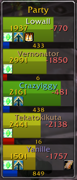
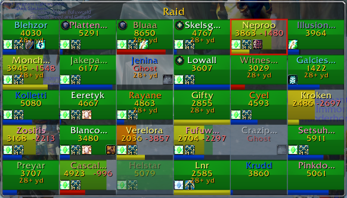
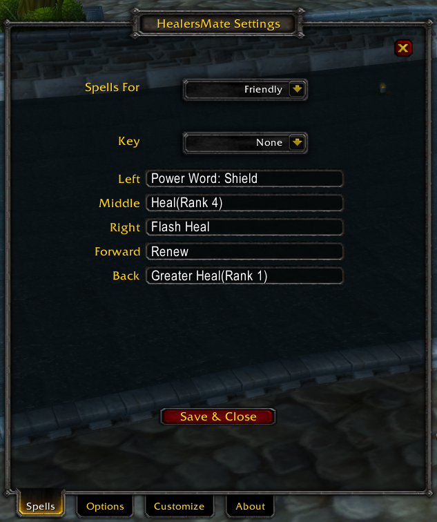
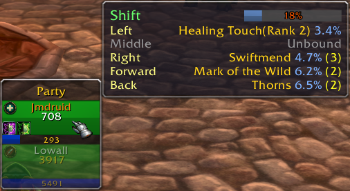
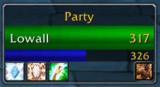
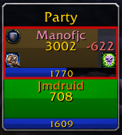
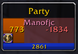

# HealersMate

HealersMate is a comprehensive healing addon designed for Vanilla World of Warcraft version 1.12. It aims to provide an easy-to-use and functional out-of-box healing experience while also providing many customization options akin to modern WoW's VuhDo or Healbot, but without being too overbearing. It supports healing parties, raids, pets, and targets.

  
  

### Customizable Key Bindings
Bind key+button combinations to specific spells, allowing you to cast on any player with one click. 
Utilize the keywords "<i>target</i>", "<i>follow</i>", and "<i>assist</i>" in place of a spell name to perform those actions.

### View Spells at a Glance

When hovering over a player, a tooltip is displayed showing you what spells you have bound, their power cost, and how many times you can cast them.

### Buff/Debuff/Dispel Tracking

HealersMate will display buffs and debuffs relevant to you, as well as color heath bars when a player has a debuff you can dispel.

  
  
  

### 2.0.0 Alpha

Currently, 2.0.0 is in Alpha, which means there may be bugs and there are certain features lacking. Namely, a way to customize the UI. Under the hood, a lot of things are in place, but a user-friendly configuration is in the works. If you're feeling bold and know how to mess around with Lua, you can edit the top half of the Settings.lua file to customize your UI.

---
Feel free to contribute, report issues, or suggest improvements. Your feedback is valuable in making HealersMate a powerful and user-friendly healing solution for the Vanilla WoW community.

## Installation
1. [Download the latest release zip](https://github.com/i2ichardt/HealersMate/releases/).
2. Extract the files into your WoW addons folder.
3. Launch World of Warcraft and enjoy a smoother healing experience with HealersMate.

---

**Reminder:** This addon is designed for use in Vanilla World of Warcraft version 1.12 and is NOT compatible with Classic(1.13+) versions of WoW.
