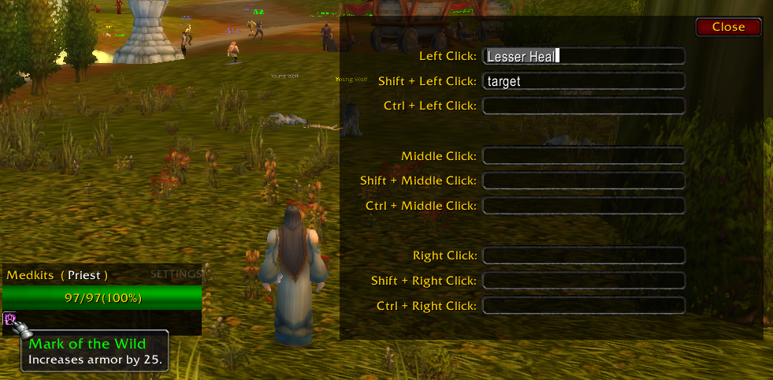
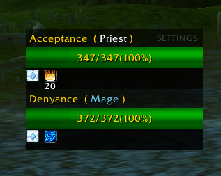
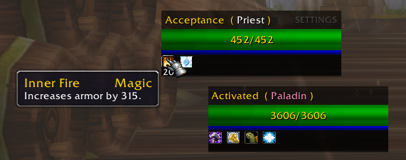
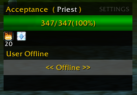

# HealersMate

HealersMate is a comprehensive healing addon designed for Classic World of Warcraft version 1.12, tailored to streamline your healing experience in parties of 1 to 5 players.

## Version 1.2.0 Features:

### Customizable Key Bindings
Effortlessly set spells to be cast with various key combinations, enhancing your control over healing actions. Key bindings include:
- Left Click
- Shift + Left Click
- Ctrl + Left Click
- Middle Click
- Shift + Middle Click
- Ctrl + Middle Click
- Right Click
- Shift + Right Click
- Ctrl + Right Click

Optional: Utilize the keywords "target," "follow," and "assist" in place of a spell name to seamlessly perform those actions with a simple click on a target.

### Buff Tracking
HealersMate includes a detailed display of buffs, complete with stack sizes, providing you with crucial information at a glance.

### Customizable Healing UI
Tailor the healing interface to your preferences by individually moving and placing UI elements for the player, players target, and individual party members.

### Offline Player Notification
Stay informed even when players are offline, ensuring you have a clear overview of the party's status at all times.

---

Feel free to contribute, report issues, or suggest improvements. Your feedback is valuable in making HealersMate a powerful and user-friendly healing solution for the Classic WoW community.

## Installation
1. [Download the latest release](https://github.com/i2ichardt/HealersMate/releases/download/v1.2.0/HealersMate.zip).
2. Extract the files into your WoW addons folder.
3. Launch World of Warcraft and enjoy a smoother healing experience with HealersMate.

---

**Reminder:** This addon is designed for use in Classic World of Warcraft version 1.12.
