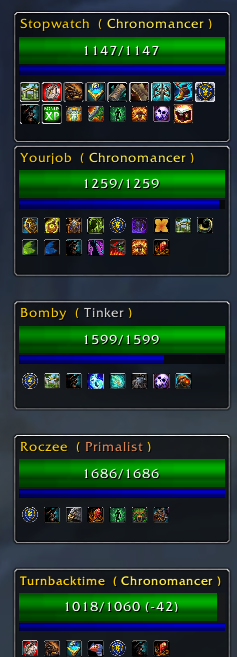
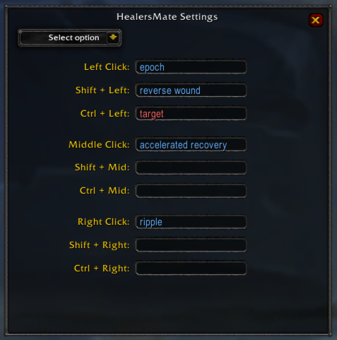
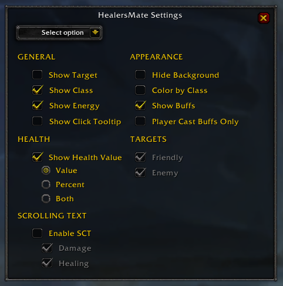
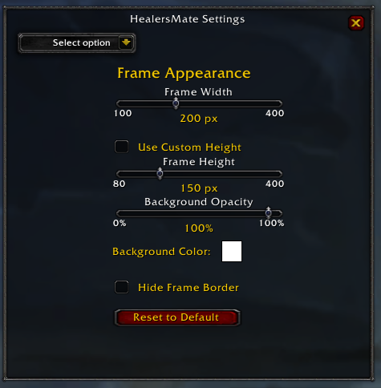

# HealersMate

A lightweight healing-focused party and target frame addon for **World of Warcraft 3.3.5a (Wrath of the Lich King)**.

HealersMate provides customizable healing frames, click-casting support, buff tracking, health monitoring, power bars, scrolling combat text, and extensive appearance options—all designed to keep critical healing information visible without requiring large raid-frame addons.

> Current Version: **1.0.0**

> Specifically designed to work with 

---

# Features

## Healing-Oriented Unit Frames

- Player frame
- Party member frames
- Optional target frame
- Friendly and enemy target support
- Health and power monitoring
- Class display options
- Class-colored player names

## Click-Casting

Bind spells directly to mouse buttons:

| Click Type | Supported |
|------------|------------|
| Left Click | ✅ |
| Middle Click | ✅ |
| Right Click | ✅ |
| Shift + Left | ✅ |
| Shift + Middle | ✅ |
| Shift + Right | ✅ |
| Ctrl + Left | ✅ |
| Ctrl + Middle | ✅ |
| Ctrl + Right | ✅ |

Simply enter spell names in the settings panel and cast directly from unit frames.

---

## Buff & Debuff Tracking

- Display buffs and debuffs directly on unit frames
- Optional player-cast-only filtering
- Dynamic aura updates
- Stack count support

---

## Health Display Options

Choose how health information is displayed:

- Current / Max Health
- Missing Health Value
- Health Percentage
- Both Value and Percentage
- Hide numeric health values entirely

---

## Power Bars

Optional secondary resource bars:

- Mana
- Rage
- Energy
- Focus
- Runic Power

---

## Scrolling Combat Text

Display healing and damage directly on unit frames.

Options include:

- Enable / Disable SCT
- Show Healing
- Show Damage

---

## Appearance Customization

Customize the look of every frame:

### Frame Size

- Adjustable width
- Adjustable height
- Auto-sizing support

### Colors & Opacity

- Background color picker
- Adjustable transparency
- Hide frame backgrounds
- Hide frame borders

### Layout

- Buff visibility controls
- Power bar visibility
- Class coloring
- Health text formatting

---

## Tooltips

Optional mouse-over tooltip support showing:

- Bound click actions
- Assigned spells
- Quick healing reference information

---

# Screenshots

## Main Party Frames



---

## Click-Casting Configuration



---

## Settings Window



---

## Appearance Customization



---

## Buff & Debuff Tracking


---

# Installation

1. Download the latest release.
2. Extract the addon folder.
3. Copy the folder into:

```text
World of Warcraft/
└── Interface/
    └── AddOns/
        └── HealersMate/
```

4. Launch the game.
5. Enable **HealersMate** from the AddOns menu.

---

# Commands

| Command | Description |
|----------|-------------|
| `/hm` | Open settings |
| `/healersmate` | Open settings |

---

# Configuration

The settings interface contains several categories:

### General

- Show Target
- Show Class
- Show Energy
- Show Click Tooltip

### Appearance

- Show Buffs
- Player-Cast Buffs Only
- Hide Background
- Color Names By Class

### Health

- Health Value Display
- Percentage Display
- Combined Display

### Targets

- Friendly Targets
- Enemy Targets

### Scrolling Text

- Damage
- Healing

### Frame Appearance

- Width
- Height
- Opacity
- Background Color
- Border Visibility

---

# Compatibility

| Expansion | Status |
|------------|---------|
| Wrath of the Lich King 3.3.5a | ✅ Supported |
| Classic Era | ❌ Not Supported |
| Retail WoW | ❌ Not Supported |

---

# Why HealersMate?

HealersMate was created for players who want:

- Lightweight healing frames
- Fast click-casting
- Easy customization
- Minimal screen clutter
- WotLK 3.3.5a compatibility

without relying on large raid-frame suites.

---

# Credits

### Original Author

- i2ichardt

### Contributors

- Claude
- ChatGPT
- Gemini
  
---

# Issues & Suggestions

Found a bug or have a feature request?

Open an issue on GitHub and include:

- WoW client version
- Steps to reproduce
- Lua errors (if any)
- Screenshots

---

```text
All Rights Reserved
```
